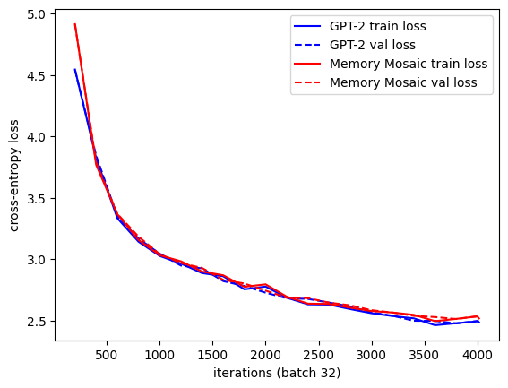

# Memory Mosaics in JAX

[Memory Mosaics](https://arxiv.org/abs/2405.06394v3) (Zhang et al., ICLR 2025) and a GPT-2 baseline in
raw `jax.numpy`, written in the style of the [JAX training cookbook](https://docs.jax.dev/en/latest/the-training-cookbook.html),
with code to reproduce the 1-block panel of Fig. 7. The two models are laid out side by side:

```bash
git diff --no-index src/mm_jax/gpt2.py src/mm_jax/memory_mosaic.py
```

| GPT-2 | Memory Mosaic |
|---|---|
| causal self-attention | ContextMem: kernel regression over the sequence's own (key, value) pairs |
| q, k, v: projections of `x_t` | key: leaky average of past projections; value: mixes `x_t` and `x_{t+1}`; both unit-normed |
| query `t` sees keys `≤ t` | query `t` sees keys `< t`, so the value's peek can't leak |
| `1/√d` score scaling | learned per-head bandwidth |
| MLP | PersistentMem: the same retrieval over a learned key/value bank |
| positional embeddings | none |
| init std 0.02; logits `x·Eᵀ` | init std 1/√fan_in; logits `x·Eᵀ/√d` |

Models and training follow the code behind the paper's runs (`Library/` in
[facebookresearch/MemoryMosaics](https://github.com/facebookresearch/MemoryMosaics)): with equal weights,
logits and 5 training steps match it to float32 rounding (`tests/check_reference.py`). `config.py` defaults are the paper's setup: BabiStories
(474.7M / 4.7M train / val tokens), d = 768, 12 heads, context 512, batch 512, AdamW (0.9, 0.95),
lr 5e-3, 2,000 warmup steps, cosine decay to 1e-4 over 80,000 steps, weight decay 0.1, dropout 0.05.

## Run

```bash
pip install -r requirements.txt
python tests/test_smoke.py
```

`python tests/check_reference.py` (needs `pip install torch`) runs the comparison with the authors' code.

[`notebooks/memory_mosaics_colab.ipynb`](notebooks/memory_mosaics_colab.ipynb) runs in ~15 min on a Colab
TPU or GPU (fastest: v6e-1 TPU): sanity checks, then the paper's model, data and optimizer, with batch size = 32 and as
many steps that fit within 8 minutes. That covers the start of training, while the paper's curves begin after ~1B tokens, so it shows
early trends, not Fig. 7's precise values. `PAPER_RUN = True` runs the full recipe (21B tokens per model), checkpointing at every
evaluation; rerunning the notebook resumes from the last checkpoint.

Quick run on a Colab v6e-1 TPU (4,004 steps, 66M tokens per model):



## Differences from the official PyTorch implementation

- **float32 instead of float16.** The reference trains in half precision, which is faster on its GPUs but
  needs loss scaling to avoid underflow. We use full 32-bit floats.
- **One device instead of 64 GPUs.** The reference splits each batch of 512 across 64 GPUs and averages
  their gradients. We split it into micro-batches on one device and average them the same way, so each
  update is identical.
- **Axis order.** Per-head tensors are laid out (batch, time, head, dim) instead of (batch, head, time, dim).
- **No (1 − e^−β) factor in the leaky average.** The reference multiplies each key by it and then normalizes
  the key to unit length, which just removes a constant factor, so we skip it.
- **GPT-2 attention written out.** Instead of PyTorch's fused attention kernel, the same formula is written
  with `einsum`, so dropout can apply to the attention weights and the code mirrors ContextMem line by line.
- **Random numbers.** Initial weights, dropout masks and batches come from JAX's and NumPy's generators, so
  runs can't match the reference bit for bit; the distributions should be the same.

## Credits

Ported from the authors' PyTorch code in
[facebookresearch/MemoryMosaics](https://github.com/facebookresearch/MemoryMosaics) (Apache-2.0,
© Meta Platforms, Inc. and affiliates), whose GPT-2 baseline derives from
[nanoGPT](https://github.com/karpathy/nanoGPT) (MIT). BabiStories is downloaded from the same repository.
